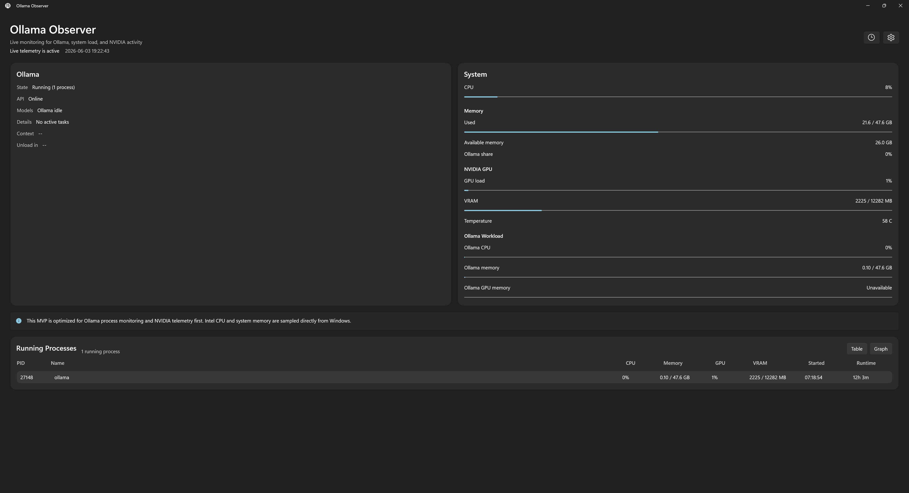
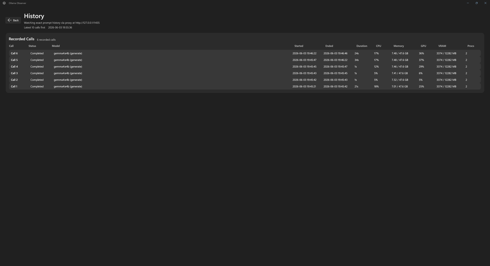
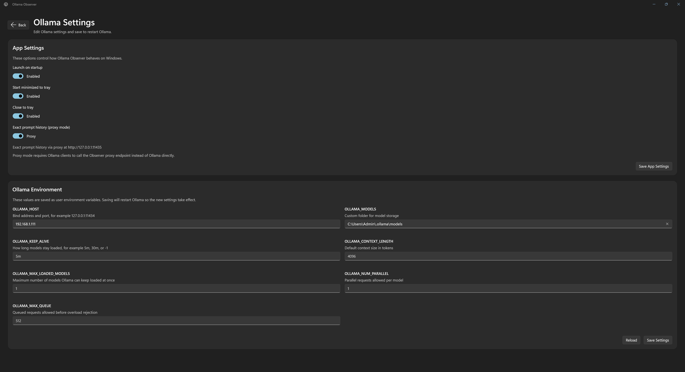

<p align="center">
  
</p>

# Ollama Observer

Ollama Observer is a Windows desktop observation and settings tool for local Ollama setups. It combines live Ollama process visibility, hardware telemetry, request history, and common Ollama settings management in a single WinUI 3 app.

It is built for people running Ollama locally who want a lightweight desktop tool for:

- whether Ollama is running
- which models are loaded
- current CPU, RAM, GPU, and VRAM pressure
- live Ollama processes
- recent Ollama request history
- viewing and editing common Ollama environment settings

## Screenshots

### Dashboard



### Settings



### History



## What The App Does

- Observes the local Ollama process and API state
- Shows loaded models, context, unload timing, and activity details
- Displays system CPU, RAM, NVIDIA GPU load, VRAM, and GPU temperature
- Displays running Ollama processes in both table and graph views
- Tracks recent Ollama history
- Supports tray mode, startup launch, and start minimized
- Lets you review and edit common Ollama environment variables from inside the app

## Monitoring Modes

Ollama Observer currently supports two history modes.

### Passive Mode

Passive mode watches Ollama activity and infers sessions from telemetry such as CPU usage, loaded models, and process behavior.

Use this if:

- you do not want to change any client configuration
- you only need approximate session history

Limitations:

- back-to-back prompts can still be harder to separate perfectly
- this mode tracks activity sessions, not exact API request boundaries

### Proxy Mode

Proxy mode is the more accurate option. The app starts a local proxy endpoint and records exact Ollama request boundaries for supported endpoints such as chat and generate.

Use this if:

- you want prompt-level history instead of inferred sessions
- you are okay pointing your Ollama clients at the Observer proxy

Important:

- Ollama itself still runs on `http://127.0.0.1:11434`
- the Observer proxy runs on `http://127.0.0.1:11435`
- for exact history, your clients must call `11435`, not `11434`

If proxy mode is enabled but your clients still talk directly to Ollama, the app will not be able to record exact prompt history from those requests.

## Included App Features

### Dashboard

- Ollama state
- Ollama API state
- loaded model summary
- context and unload timing
- system CPU and memory
- NVIDIA GPU load and VRAM
- Ollama workload CPU and memory
- process table with CPU, RAM, GPU, and VRAM summaries

### Running Processes

- table view for quick inspection
- graph view for live trend bars
- per-process CPU and memory history
- workload-level GPU and VRAM trends shown in the graph tiles

### History

- last recorded calls first
- duration, CPU, memory, GPU, VRAM, and process count
- passive inferred sessions or exact proxy-tracked calls, depending on mode

### Settings

App settings:

- launch on startup
- start minimized to tray
- close to tray
- exact prompt history proxy mode

Ollama environment settings:

- `OLLAMA_HOST`
- `OLLAMA_MODELS`
- `OLLAMA_KEEP_ALIVE`
- `OLLAMA_CONTEXT_LENGTH`
- `OLLAMA_MAX_LOADED_MODELS`
- `OLLAMA_NUM_PARALLEL`
- `OLLAMA_MAX_QUEUE`

Saving Ollama environment settings restarts Ollama so the new values take effect.

## Requirements

- Windows 10 or Windows 11
- Ollama installed locally
- Ollama API reachable on `http://127.0.0.1:11434`
- NVIDIA GPU with `nvidia-smi` available for full GPU telemetry

## Running The App

At the moment this repository is source-first. The app runs as an unpackaged WinUI 3 desktop app.

### Build

```powershell
dotnet build .\OllamaObserver\OllamaObserver.csproj
```

### Launch

```powershell
.\OllamaObserver\bin\Debug\net10.0-windows10.0.26100.0\win-x64\OllamaObserver.exe
```

If you enable startup and tray behavior, the app can also:

- create a desktop shortcut
- stay resident in the tray
- launch directly to tray on sign-in

## Proxy Mode Setup

If you want exact prompt history:

1. Open `Settings`
2. Enable `Exact prompt history (proxy mode)`
3. Save app settings
4. Point your Ollama client to `http://127.0.0.1:11435`

Example idea:

- direct Ollama: `http://127.0.0.1:11434`
- Observer proxy: `http://127.0.0.1:11435`

Only requests that go through the proxy can be recorded as exact prompt history.

## Known Limitations

- The app is currently focused on Windows desktop usage
- Per-process GPU and VRAM values are not true NVIDIA per-process attribution in all cases
- On this machine, `nvidia-smi` does not return usable per-process Ollama GPU memory, so the app falls back to Ollama API data when possible
- Passive mode is approximate by design
- Proxy mode requires client reconfiguration
- The app currently assumes a local Ollama instance and does not yet target remote Ollama fleets

## Why Someone Might Want This

Ollama itself is easy to run, but it can be harder to answer simple questions while working:

- Is Ollama actually doing anything right now?
- Did that prompt finish or stall?
- Is VRAM getting close to full?
- How many Ollama processes are active?
- Did a settings change actually reduce memory pressure?

Ollama Observer is meant to answer those questions quickly while also giving you one place to adjust the most useful local Ollama settings without opening Task Manager, `nvidia-smi`, or several terminal windows.

## Status

This project is active and still evolving. Monitoring, history, and settings behavior are being refined as more hardware combinations and real-world usage patterns are tested.

## Hardware Disclaimer

This app has currently only been tested on an Intel CPU plus NVIDIA GPU setup.

If you are running:

- AMD CPU
- AMD GPU
- Intel GPU
- other Windows hardware combinations

and you are willing to help test hardware-specific monitoring and compatibility, please open an issue or reach out with your hardware details, screenshots, and notes.

I am especially looking for help from:

- AMD CPU users
- AMD GPU users
- Intel GPU users

Testing feedback from those setups will help expand support and improve telemetry handling over time.
